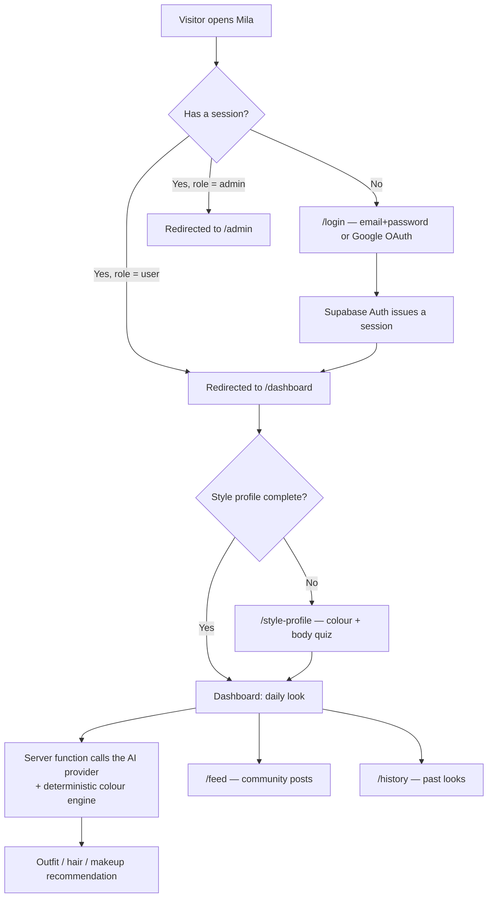
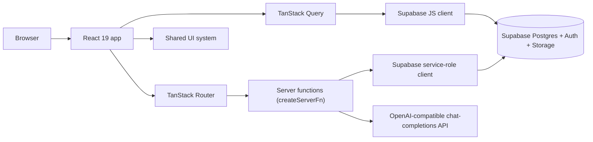

# Mila

Mila is an AI-assisted personal styling platform. It builds a member's colour-season and
body-silhouette profile from a portrait, then uses that profile — together with live weather
and an occasion "vibe" — to generate a daily outfit, hair, and makeup recommendation. Members
can also analyze wardrobe photos, search for cheaper product "dupes," share looks to a
moderated community feed, and chat with a conversational styling assistant.


No automated test suite, CI workflow, or license file currently exists in this repository —
see [Testing](#testing) and [License](#license).

## Table of Contents

- [Overview](#overview)
- [Product Capabilities](#product-capabilities)
- [How the System Works](#how-the-system-works)
- [Architecture](#architecture)
- [Technology Stack](#technology-stack)
- [Project Structure](#project-structure)
- [Application Routes](#application-routes)
- [Authentication and Authorization](#authentication-and-authorization)
- [Data and State Management](#data-and-state-management)
- [Database and Supabase](#database-and-supabase)
- [Forms and Validation](#forms-and-validation)
- [Admin System](#admin-system)
- [Design System](#design-system)
- [Icons](#icons)
- [Environment Variables](#environment-variables)
- [Getting Started](#getting-started)
- [Development Scripts](#development-scripts)
- [Development Workflow](#development-workflow)
- [Build and Production](#build-and-production)
- [Deployment](#deployment)
- [Code Quality](#code-quality)
- [Testing](#testing)
- [Security](#security)
- [Accessibility](#accessibility)
- [Troubleshooting](#troubleshooting)
- [Contributing](#contributing)
- [Project Status](#project-status)
- [License](#license)

## Overview

Mila is built for people who find outfit selection time-consuming and want guidance anchored
to _their_ colouring and shape, not generic trend content. Instead of a static lookbook, the
app treats the member's profile (colour season, silhouette, face shape, hair type, beauty
preferences) as a durable "style dossier" that every recommendation is generated against, and
recomposes the recommendation daily using live weather and a chosen occasion vibe.

The current implementation is a single web application (TanStack Start, deployed as one
server), not a native mobile app or a multi-service backend. Personalization is driven by a
combination of:

- A deterministic, hand-authored 16-season colour-analysis engine (`src/lib/color-analysis/`)
- An OpenAI-compatible chat-completions API for portrait analysis and look generation, called
  through a small provider-agnostic client
- Row-Level-Security-scoped Postgres data (Supabase) for everything else

## Product Capabilities

Status reflects what was confirmed by reading the code, not the product's ambitions.

| Area                                                  | Status           | Description                                                                                                                                                                                                     |
| ----------------------------------------------------- | ---------------- | --------------------------------------------------------------------------------------------------------------------------------------------------------------------------------------------------------------- |
| Email/password + Google sign-in                       | Implemented      | Supabase Auth; see [Authentication](#authentication-and-authorization)                                                                                                                                          |
| Style profile / colour-season quiz                    | Implemented      | Body type, face shape, hair, beauty preferences, 16-season colour dossier (`/style-profile`)                                                                                                                    |
| Daily look generation                                 | Implemented      | Outfit + hair + makeup, weather- and vibe-aware, via `generate-outfit.functions.ts`                                                                                                                             |
| Outfit history                                        | Implemented      | Past generated looks, stored in `outfits` (`/history`)                                                                                                                                                          |
| Wardrobe/outfit photo analysis                        | Implemented      | `analyze-clothing.functions.ts`, `analyze-outfit.functions.ts`                                                                                                                                                  |
| Dupe hunter                                           | Implemented      | Photo → AI read → matched against a seeded affiliate `products`/`brands` catalog                                                                                                                                |
| Stylist chat                                          | Implemented      | `fix-outfit-chat.functions.ts` — conversational outfit-fixing chat                                                                                                                                              |
| Community feed                                        | Implemented      | Members post outfit photos (`posts`); moderation-aware visibility                                                                                                                                               |
| Admin dashboard, member/moderation/support management | Implemented      | See [Admin System](#admin-system)                                                                                                                                                                               |
| Credits / paywall                                     | **Mocked**       | `consumeAiCredit` is a stub that always returns `999`; the real gate is disabled with a `TODO: Re-enable premium gate before production launch`                                                                 |
| In-app purchases                                      | **Planned only** | `purchases` table and `CREDIT_PACKS` pricing copy exist; no payment processor, webhook, or IAP code was found                                                                                                   |
| Ad rewards                                            | **Planned only** | `ad_events` table exists in the schema; no ad SDK or event-recording code was found in the application                                                                                                          |
| Moderator role                                        | **Partial**      | `app_role` enum includes `moderator` and `.env.example` documents a dev moderator account, but `admin.functions.ts` only ever checks for the `admin` role — no moderator-specific authorization path exists yet |
| Password reset                                        | **Not found**    | No `resetPasswordForEmail` call or reset-password route exists                                                                                                                                                  |

## How the System Works



The landing page (`/`) itself checks for a session during route load and immediately redirects
signed-in visitors to `/dashboard` (or `/admin` if their role is admin) — it is only ever seen
by signed-out visitors in practice.

## Architecture



### Client layer

React 19 + TypeScript render the whole interface. Shared UI primitives live in
`src/components/ui/` (Radix UI underneath, styled with Tailwind and `class-variance-authority`).
Client state is minimal: a `use-auth.tsx` context wraps Supabase's session, and a handful of
`useState` hooks drive local UI (dialogs, drawers, form toggles). Framer Motion provides page
and reveal animation on the marketing site and a few interactive surfaces.

### Routing layer

TanStack Router is file-based: every file under `src/routes/` becomes a route, and the tree is
generated into `src/routeTree.gen.ts` by the TanStack Router Vite plugin. Layout routes prefixed
with `_` (`_authenticated`, `_authenticated/_app`) wrap their children without adding a URL
segment. See [Application Routes](#application-routes) for the concrete list and
[Authentication and Authorization](#authentication-and-authorization) for how each layer is
actually guarded.

### Data layer

TanStack Query owns server-state caching for anything read more than once (profile, feed,
credits, all admin data) via `queryOptions()` factories in `src/lib/queries/`. Some
straightforward client-owned reads/writes (auth session, direct `profiles` queries) call the
Supabase JS client directly; anything that needs the service-role key, calls the AI provider, or
must be re-verified server-side goes through a `createServerFn` in `src/lib/*.functions.ts`.
Mutations invalidate the relevant `queryKeys` entry (`src/constants/query-keys.ts`) on success;
errors surface through Sonner toasts.

### Server layer

TanStack Start provides the server-function runtime (`createServerFn`) and SSR document
rendering; Nitro packages the production server bundle. In development, `vite dev` serves both
the client and server-function endpoints over HTTPS (via `vite-plugin-mkcert`, so camera capture
works as a secure context, including from another device on the same LAN). In production,
`vite build` emits a self-contained Nitro server bundle to `.output/`, started with
`bun .output/server/index.mjs`.

## Technology Stack

| Category                  | Technology                                           | Role in this repository                                                                            |
| ------------------------- | ---------------------------------------------------- | -------------------------------------------------------------------------------------------------- |
| Runtime / package manager | Bun                                                  | Installs dependencies and runs all `package.json` scripts                                          |
| Framework                 | TanStack Start                                       | SSR document rendering + server functions (`createServerFn`)                                       |
| Routing                   | TanStack Router                                      | File-based routing, typed navigation, route guards                                                 |
| UI                        | React 19 + TypeScript (strict)                       | Component rendering and static typing                                                              |
| Build                     | Vite 7                                               | Dev server and production bundling; Nitro plugin packages the server output                        |
| Server runtime            | Nitro                                                | Production server bundle consumed by `bun run start`                                               |
| Styling                   | Tailwind CSS v4 (`@tailwindcss/vite`)                | Utility classes and CSS-first design tokens (`src/styles.css`)                                     |
| UI primitives             | Radix UI                                             | Accessible unstyled primitives (dialog, dropdown, select, tabs, accordion, popover, switch, label) |
| Component variants        | `class-variance-authority`, `clsx`, `tailwind-merge` | Typed variant/size APIs and safe class merging (`cn()`)                                            |
| Icons                     | Lucide React                                         | Named-import icon components throughout the UI                                                     |
| Animation                 | Framer Motion                                        | Page reveals and interactive transitions                                                           |
| Notifications             | Sonner                                               | Toast notifications for success/error feedback                                                     |
| Carousel                  | Embla Carousel React                                 | `src/components/ui/carousel.tsx`                                                                   |
| Data fetching / caching   | TanStack Query                                       | Server-state caching, mutations, invalidation                                                      |
| Tables                    | TanStack Table                                       | Admin data tables (sorting, filtering, pagination)                                                 |
| Forms                     | React Hook Form                                      | Form state and submission handling                                                                 |
| Validation                | Zod (+ `@hookform/resolvers`)                        | Schema validation shared between client forms and server function inputs                           |
| Database / Auth / Storage | Supabase (`@supabase/supabase-js`)                   | Postgres, JWT auth, Row Level Security, file storage                                               |
| Bot protection            | hCaptcha (`@hcaptcha/react-hcaptcha`)                | Challenge widget on login/signup, token passed to Supabase Auth                                    |
| Linting                   | ESLint 9 + `typescript-eslint`                       | Static analysis (`bun run lint`)                                                                   |
| Formatting                | Prettier 3                                           | Code formatting (`bun run format`)                                                                 |
| CSS pipeline              | Lightning CSS                                        | CSS transformer used by both dev and build (configured in `vite.config.ts`)                        |
| Local HTTPS               | `vite-plugin-mkcert`                                 | Locally-trusted TLS cert for the dev server (camera access requires a secure context)              |

`tw-animate-css` is installed and imported in `src/styles.css` for its keyframe utilities (Radix
open/close animations); its active usage was confirmed but it is not a design-system dependency
you would configure directly.

## Project Structure

```text
.
├── public/                      Static assets (favicon, Google logo)
├── src/
│   ├── components/
│   │   ├── ui/                  Shared primitives: Button, Card, Input, Dialog, DataTable, ...
│   │   ├── admin/                Admin shell, sidebar, header, tables, dialogs
│   │   ├── account/               Membership drawer
│   │   ├── capture/               Camera / gallery capture flow
│   │   ├── dashboard/             Daily look, climate widget, concierge, upgrade dialog
│   │   ├── feed/                  Community feed post rendering
│   │   ├── landing/                Marketing site sections
│   │   ├── layout/                 App shell, navigation, theme toggle/provider
│   │   ├── login/                  Auth card, login/signup forms, support dialog
│   │   ├── studio/                 Style-profile onboarding forms
│   │   ├── style-profile/          Colour quiz, body-type quiz, dossier views
│   │   └── wardrobe/                Daily palette generator
│   ├── constants/                 App-wide constants (query keys, copy, password rules, ...)
│   ├── hooks/                     `use-auth`, `use-sign-out`
│   ├── integrations/supabase/     Browser client, service-role client, auth middleware, generated DB types
│   ├── lib/                       Server functions (`*.functions.ts`), AI client, colour-analysis engine, query options
│   ├── routes/                    File-based TanStack Router routes (see below)
│   ├── router.tsx                 Router instance creation
│   ├── start.ts                   TanStack Start entry (registers the auth-attaching middleware)
│   └── styles.css                 Tailwind v4 tokens and base/component layers
├── supabase/
│   ├── config.toml                 Supabase project reference
│   └── migrations/                 SQL schema, RLS policies, storage buckets, seed data
├── docs/superpowers/               Design/implementation specs and plans from prior work sessions
├── package.json
├── vite.config.ts
├── tsconfig.json
├── eslint.config.js
└── README.md
```

`src/routeTree.gen.ts` and the `.output/` production bundle are generated — they are not part of
the source tree to read or edit directly.

## Application Routes

| Route               | Access                    | Purpose                                                                          |
| ------------------- | ------------------------- | -------------------------------------------------------------------------------- |
| `/`                 | Public                    | Landing/marketing page; redirects signed-in visitors to `/dashboard` or `/admin` |
| `/login`            | Public                    | Email/password and Google OAuth sign-in and sign-up (tabbed)                     |
| `/auth/callback`    | Public                    | OAuth session exchange, then redirects to `next` (defaults to `/dashboard`)      |
| `/dashboard`        | Authenticated             | Daily look generation, camera/gallery capture, credits, membership drawer        |
| `/feed`             | Authenticated             | Community feed of member outfit posts                                            |
| `/history`          | Authenticated             | Previously generated looks                                                       |
| `/style-profile`    | Authenticated             | Colour-season and body-profile quiz; "digital style dossier"                     |
| `/admin`            | Authenticated, admin role | Dashboard stats (members, credits, posts, support)                               |
| `/admin/members`    | Authenticated, admin role | Member list — grant/revoke admin, suspend, create/edit accounts                  |
| `/admin/moderation` | Authenticated, admin role | Hide/restore/delete feed posts                                                   |
| `/admin/support`    | Authenticated, admin role | Help-desk and feedback message triage                                            |

`/dashboard`, `/feed`, `/history`, and `/style-profile` share a pathless `_authenticated/_app`
layout route (top/bottom navigation chrome); `/admin*` shares a separate `_authenticated/admin`
layout (sidebar + header). Both ultimately nest under the `_authenticated` layout route that
performs the actual session check — see below.

## Authentication and Authorization

Authentication verifies who a user is. Authorization determines what that authenticated user is
allowed to do. Mila's implementation keeps these genuinely separate, and enforces them at
different layers.

### Authentication

- Provider: Supabase Auth. Email/password and Google OAuth are both implemented
  (`src/components/login/`); no other OAuth provider was found.
- Signup sends a confirmation email (`email_confirm` is not force-enabled by the client call —
  the "Check your inbox to confirm" toast implies Supabase's default confirmation flow is active
  on the project).
- Session state lives client-side in `src/hooks/use-auth.tsx`, backed by
  `supabase.auth.onAuthStateChange` + `getSession()`, persisted to `localStorage` by the
  Supabase client (`src/integrations/supabase/client.ts`).
- **No password-reset flow exists** in the current codebase (no `resetPasswordForEmail` call, no
  reset route or form).
- Logout clears the Supabase session and hard-navigates to `/`.

### Route-level guarding

`src/routes/_authenticated.tsx` is the single real gate for "must be signed in": its
`beforeLoad` calls `supabase.auth.getSession()` and throws a redirect to `/login` if there is no
session, and the component additionally redirects client-side on mount as a fallback. This check
is skipped during server-side rendering (`typeof window === "undefined"`), so the guard is
effectively client-only — a page could be server-rendered before the redirect fires, though a
signed-out client cannot successfully call any protected server function regardless (see below).

`src/routes/_authenticated/admin.tsx` renders `AdminShell` with **no route-level admin check at
all**. Admin authorization is enforced by the `AdminShell` component itself, which queries
`adminAmIAdmin()` and renders a "Restricted" screen for non-admins — this is a UI-level gate, not
a route redirect.

### Server-side enforcement

Every admin server function (`src/lib/admin.functions.ts`) independently calls an `assertAdmin`
helper that queries the `has_role` Postgres RPC before doing anything — this re-check happens
regardless of what the client UI shows, so a non-admin cannot read or mutate admin data even if
the client-side "Restricted" screen were bypassed. Every server function in the app (admin or
not) runs behind the `requireSupabaseAuth` middleware
(`src/integrations/supabase/auth-middleware.ts`), which verifies the bearer JWT via
`supabase.auth.getClaims()` and additionally re-checks `profiles.suspended` on every call —
suspended accounts are rejected server-side even if a stale client session is still active.

### Roles and suspension

Roles live in `public.user_roles` (`app_role` enum: `admin`, `moderator`, `user`) and are
assigned by the `handle_new_user()` database trigger (every new signup gets `user`
automatically) or, for `admin`, by another admin through `/admin/members`. The `moderator` role
exists in the schema and in `.env.example` but no code path currently checks for it — see
[Product Capabilities](#product-capabilities). Suspension (`profiles.suspended`) is
service-role-only to write (enforced by column-level Postgres grants, not just RLS) and is
checked both client-side (a full-screen "Membership Suspended" notice) and server-side (rejected
by the auth middleware).

### CAPTCHA

hCaptcha renders on the login/signup form and its token is passed into
`supabase.auth.signInWithPassword` / `signUp`. Whether Supabase actually verifies that token
against hCaptcha is a Supabase project setting (Auth → Attack Protection), not something
configured in this repository — no server-side hCaptcha secret or verification call exists in
the codebase.

## Data and State Management

1. A route or component requests data through a `queryOptions()` factory
   (`src/lib/queries/*.ts`), which wraps either a direct Supabase call or a `createServerFn`.
2. TanStack Query caches the result under a key from `src/constants/query-keys.ts` and exposes
   loading/error/success state to the component.
3. Mutations call a server function directly, then call `queryClient.invalidateQueries` for the
   affected key(s) on success, and surface errors via `toast.error` (Sonner).
4. Form state is owned by React Hook Form; validation schemas are Zod, and in several server
   functions the _same shape of validation_ is re-applied server-side via `.validator()` — the
   client form and the server input boundary are not just trusting each other.
5. Auth/session state is a separate React context (`use-auth.tsx`), not part of the Query cache.
6. There is no URL-based filter/search state and no persisted client state beyond the Supabase
   session in `localStorage` and the theme preference (`localStorage`, key `mila-theme`).

## Database and Supabase

Supabase provides Postgres, Auth, and Storage. Two clients exist:

- `src/integrations/supabase/client.ts` — browser client, anon/publishable key, persists the
  session to `localStorage`.
- `src/integrations/supabase/client.server.ts` — service-role client, used only inside server
  functions (imported lazily, e.g. `await import("@/integrations/supabase/client.server")`, so
  the service-role key is never bundled for the browser).
- `src/integrations/supabase/auth-middleware.ts` — a third, request-scoped client created per
  server-function call, authenticated as the _caller_ (not service-role), used specifically so
  Row Level Security applies where a function doesn't need to bypass it.

Migrations live in `supabase/migrations/` (4 files, most recent 2026-07-10) and are the source
of truth for the schema below — generated TypeScript types are in
`src/integrations/supabase/types.ts`.

| Table                 | Purpose                                                                                          |
| --------------------- | ------------------------------------------------------------------------------------------------ |
| `profiles`            | One row per user: name, username, colour/body/beauty profile, suspension flag                    |
| `outfits`             | Generated/analyzed looks, stored per user (powers `/history`)                                    |
| `user_entitlements`   | AI credit balance and `ads_removed` flag, service-role write only                                |
| `purchases`           | Schema for payment history — **not read or written by any application code found**               |
| `ad_events`           | Schema for ad impression/reward tracking — **not read or written by any application code found** |
| `brands` / `products` | Seeded affiliate catalog matched against by the dupe hunter                                      |
| `user_favorites`      | Saved products                                                                                   |
| `posts`               | Community feed posts, with `hidden`/`hidden_reason` moderation columns                           |
| `user_roles`          | `app_role` role grants (`admin` / `moderator` / `user`)                                          |
| `support_messages`    | Help-desk and feedback submissions (separate migration; admin-only reads)                        |

Every table has Row Level Security enabled. Authorization inside policies is centralized in one
`SECURITY DEFINER` SQL function, `has_role(_user_id, _role)`, rather than repeated per policy.
Sensitive tables (`user_roles`, `user_entitlements`, `purchases`, `ad_events`) have **no client
INSERT/UPDATE policies at all** — those writes only happen through the service-role client after
an `assertAdmin`/auth check in a server function. `profiles` additionally uses column-level
Postgres grants so a signed-in user cannot clear their own `suspended` flag even though the RLS
`WITH CHECK` only validates row ownership.

Storage has two buckets: `outfits` (public — AI providers fetch the image URL directly; privacy
relies on an unguessable `userId/uuid` path) and `posts` (private — feed images are served via
short-lived signed URLs generated server-side in `admin.functions.ts`/the feed query).

## Forms and Validation

React Hook Form manages form state; Zod schemas define validation, generally declared alongside
the component or server function that uses them (there is no central schema registry). Several
server functions re-validate the same input shape with `.validator((input) => Schema.parse(input))`,
so client-side validation is a UX convenience, not the actual trust boundary. Errors are
rendered inline under each field (`text-destructive` styling) and via Sonner toasts for
submission-level failures. There is no shared `FormField`-wrapping-every-input convention across
the whole app — some forms (e.g. `MemberFormDialog`) use a shared `FormField` component; others
compose `Label` + `Input` directly.

## Admin System

The admin suite (`/admin/*`) is a full CRUD/moderation interface, not a placeholder:

- **Layout**: `AdminShell` renders a fixed sidebar (`AdminSidebar`) and a header
  (`AdminHeader`) with a mobile drawer toggle; both collapse into a slide-over drawer below the
  `lg` breakpoint.
- **Dashboard** (`/admin`): six stat cards (members, stewards, AI credits outstanding, posts,
  hidden posts, open support messages) plus "Recent Members" and "Recent Activity" panels, all
  from one `adminDashboardStats` server function.
- **Members** (`/admin/members`): a `DataTable` (search, sort, pagination) over every Supabase
  Auth user, joined with profile/role/credit data. Actions: grant/revoke admin (a `Switch`,
  disabled for your own account when it's the only admin action that would lock you out), toggle
  suspension, edit name/username, create a new member account directly (email + password, no
  invite email).
- **Moderation** (`/admin/moderation`): a card grid of feed posts with hide/restore and
  permanent-delete actions; hidden posts show a reason and a badge.
- **Support** (`/admin/support`): tabbed `DataTable`s for help-desk vs. feedback messages, with
  a resolved/unresolved toggle.

Permission checking happens at two layers, described in full in
[Authentication and Authorization](#authentication-and-authorization): client-side (a
"Restricted" screen if `adminAmIAdmin()` returns false) and server-side (every admin server
function independently calls `assertAdmin`, which is the layer that actually matters for
security). There is no route-level `beforeLoad` redirect guarding `/admin`.

## Design System

The interface follows a "warm editorial minimalism" direction — a warm cream/ivory palette,
serif display type for headings, restrained gold accents, and paper-like shadows rather than
glassmorphism or bright SaaS-dashboard styling. Tokens are defined CSS-first in `src/styles.css`
using Tailwind v4's `@theme`, with parallel `:root`/`.dark` values for light/dark mode.

| Token                                 | Purpose                                      |
| ------------------------------------- | -------------------------------------------- |
| `canvas`                              | Page background                              |
| `surface`                             | Cards and elevated content                   |
| `ink`                                 | Primary text and dark controls               |
| `muted`                               | Secondary text                               |
| `accent` / `accent-soft`              | Gold highlights, active states, hover washes |
| `line`                                | Borders and dividers                         |
| `success` / `warning` / `destructive` | Semantic status colors                       |

Radius is a five-step hierarchy (`rounded-control` → `rounded-panel` → `rounded-card` →
`rounded-overlay` → `rounded-pill`) mapped to control size rather than used arbitrarily; shadows
follow a matching `shadow-paper`/`shadow-raised`/`shadow-nav` scale. A `mila-*` set of
`@layer components` classes (`mila-page`, `mila-container`, `mila-section`, `mila-card`,
`mila-focus-ring`, `mila-dark-glass`, and others) covers cross-cutting patterns that aren't
better expressed as a React component.

Shared React primitives live in `src/components/ui/`: `Button`, `IconButton`, `Card`, `Input`
(with optional leading/trailing icon slots), `Dialog`, `Sheet`, `Select`, `Tabs`, `Accordion`,
`DropdownMenu`, `Popover`, `Switch`, `Badge`, `Avatar`, `DataTable`, `EmptyState`,
`LoadingState`, `ErrorState`, `PageHeader`, `SectionHeader`, `FormField`, and
`PasswordVisibilityButton`. Components with real variants use `class-variance-authority`; the
`cn()` helper (`src/lib/utils.ts`, `clsx` + `tailwind-merge`) is the only class-merging utility
in the codebase. Radix UI backs every primitive that needs real accessibility behavior (focus
trapping, portals, keyboard navigation) — none of it is reimplemented with plain `<div>`s.

## Icons

Lucide React is the only icon library in the codebase; icons are imported by name
(`import { Search } from "lucide-react"`), never as a wildcard or dynamically constructed from a
string. Icons normally inherit `currentColor` and use one of a small set of consistent sizes
(`size-3.5` for dense table/metadata icons, `size-4` for controls, `size-[18px]` for sidebar
navigation, `size-5`–`size-6` for buttons and empty states) with a default `strokeWidth` of
`1.75`. Decorative icons use `aria-hidden="true"`; icon-only controls carry an `aria-label`.

## Environment Variables

Copy `.env.example` to `.env` and fill in real values — never commit `.env`.

| Variable                                 |              Required | Scope                    | Description                                                                                   |
| ---------------------------------------- | --------------------: | ------------------------ | --------------------------------------------------------------------------------------------- |
| `VITE_SUPABASE_URL`                      |                   Yes | Client                   | Supabase project URL, shipped to the browser                                                  |
| `VITE_SUPABASE_PUBLISHABLE_KEY`          |                   Yes | Client                   | Supabase anon/publishable key, shipped to the browser                                         |
| `SUPABASE_URL`                           |                   Yes | Server                   | Same project URL, read by server functions                                                    |
| `SUPABASE_PUBLISHABLE_KEY`               |                   Yes | Server                   | Anon key used by the request-scoped RLS client in `auth-middleware.ts`                        |
| `SUPABASE_SERVICE_ROLE_KEY`              |                   Yes | Server, **secret**       | Bypasses RLS; used only by `client.server.ts` inside server functions                         |
| `AI_API_KEY`                             | Yes (for AI features) | Server, **secret**       | Bearer token for the chat-completions provider                                                |
| `AI_BASE_URL`                            | Yes (for AI features) | Server                   | Base URL of an OpenAI-compatible chat-completions API                                         |
| `AI_MODEL`                               | Yes (for AI features) | Server                   | Model name/ID sent with every completion request                                              |
| `VITE_HCAPTCHA_SITEKEY`                  |                   Yes | Client                   | hCaptcha site key rendered on the login/signup form                                           |
| `ADMIN_EMAIL` / `ADMIN_PASSWORD`         |                    No | Local documentation only | Not read by any application code — a convention for the manual admin-bootstrap SQL step below |
| `MODERATOR_EMAIL` / `MODERATOR_PASSWORD` |                    No | Local documentation only | Same as above; the moderator role has no authorization logic yet                              |

Any variable prefixed `VITE_` is compiled into the client bundle and is visible to anyone using
the app — never put a secret behind a `VITE_` name. `SUPABASE_SERVICE_ROLE_KEY` and `AI_API_KEY`
must stay server-only.

`.env.example` exists and is kept in sync with the variables above; if a new variable is ever
needed, add it there too.

### Bootstrapping an admin account

New signups get the `user` role automatically. To grant `admin`, create the account normally
(sign-up, or the Supabase dashboard), then run in the Supabase SQL editor:

```sql
INSERT INTO public.user_roles (user_id, role)
SELECT id, 'admin'::public.app_role FROM auth.users WHERE email = '<admin-email>'
ON CONFLICT DO NOTHING;
```

## Getting Started

Prerequisites: [Bun](https://bun.sh), a Supabase project (for the database/auth), and an
OpenAI-compatible chat-completions endpoint if you want AI features working locally.

```bash
git clone <repository-url>
cd mila
bun install
cp .env.example .env   # fill in Supabase, AI provider, and hCaptcha values
bun run dev
```

The dev server runs over HTTPS on port 8080 (a locally-trusted mkcert certificate is generated
automatically) — the terminal will print the local and LAN URLs once it's ready.

## Development Scripts

| Command             | Description                                                                         |
| ------------------- | ----------------------------------------------------------------------------------- |
| `bun run dev`       | Starts the Vite/TanStack Start development server                                   |
| `bun run build`     | Production build — bundles the client and packages the Nitro server into `.output/` |
| `bun run build:dev` | Same build, in Vite's `development` mode                                            |
| `bun run preview`   | Serves the production build locally for a final check                               |
| `bun run start`     | Runs the already-built server: `bun .output/server/index.mjs`                       |
| `bun run lint`      | Runs ESLint across the repository                                                   |
| `bun run format`    | Formats the repository with Prettier                                                |

There is no `test`, `typecheck`, `db:migrate`, or `seed` script. `bun run build` runs the full
TypeScript/Vite pipeline and will fail on type errors, which is the closest thing to a type-check
command currently available — see [Potential Improvements](#project-status).

## Development Workflow

1. Install dependencies and configure `.env` as above.
2. `bun run dev` and confirm the app loads.
3. Build the feature, reusing shared components/tokens from `src/components/ui/` and
   `src/styles.css` rather than introducing new one-off styling.
4. Use `cn()` for conditional classes and `class-variance-authority` for anything with real
   variants; keep Radix accessibility behavior (portals, focus management, keyboard nav) intact.
5. Import Lucide icons by name; keep sizes/stroke widths consistent with the rest of the app.
6. Run `bun run format`, then `bun run lint`, then `bun run build` before opening a PR.
7. Check the change at mobile and desktop widths — there is no visual regression tooling, so
   this is a manual step.
8. Avoid committing `.env` or any secret value.

## Build and Production

`bun run build` runs Vite's client build and, via the `nitro()` plugin (build-only, with
`noExternals: true` so server dependencies are bundled rather than traced from
`node_modules`), packages a self-contained server bundle into `.output/`. Run it with:

```bash
bun run build
bun run start   # runs bun .output/server/index.mjs
```

All server-scoped environment variables (`SUPABASE_URL`, `SUPABASE_PUBLISHABLE_KEY`,
`SUPABASE_SERVICE_ROLE_KEY`, `AI_API_KEY`, `AI_BASE_URL`, `AI_MODEL`) must be present in the
runtime environment that runs `bun run start` — they are not baked into the client bundle at
build time.

## Deployment

No hosting provider, container image, or deployment workflow file exists in this repository, so
this section is intentionally provider-neutral. Deploying the built Nitro server requires:

- A Bun (or compatible Node) runtime able to run `bun .output/server/index.mjs`
- All server environment variables from [Environment Variables](#environment-variables)
  configured in the hosting environment, not committed to source
- HTTPS in front of the server (required for camera capture and cookie/session security)
- The Supabase project's Auth redirect URLs updated to include the production domain
  (`/auth/callback`)
- The hCaptcha site key's allowed domains updated to include the production domain
- Running `supabase/migrations/` against the target Supabase project before first boot

## Code Quality

```bash
bun run format
bun run lint
bun run build
```

ESLint (flat config, `typescript-eslint` + `eslint-plugin-react-hooks` +
`eslint-plugin-react-refresh` + Prettier integration) and Prettier are both configured and
active. `bun run lint` does not perform type checking; `bun run build` does, as part of Vite's
TypeScript handling, and will fail the build on type errors.

## Testing

No automated test script is currently defined in `package.json`, and no test files were found
in the repository. There is no unit, integration, or end-to-end test suite today.

If a test strategy is added later, reasonable starting points given the codebase would be:

- Component tests for the shared `src/components/ui/` primitives
- Route tests for the `_authenticated` and `_authenticated/admin` guard logic
- Server-function tests for `admin.functions.ts`'s `assertAdmin` enforcement
- Form-validation tests for the Zod schemas shared between client and server
- End-to-end tests for the sign-up → style-profile → daily-look flow

## Security

Confirmed in the codebase:

- Row Level Security is enabled on every table, with a centralized `has_role()` authorization
  function and explicit `TO authenticated` / `WITH CHECK` clauses throughout the migrations.
- Every server function re-verifies the caller's JWT and suspension status
  (`requireSupabaseAuth`); admin server functions additionally re-verify the `admin` role
  independent of any client-side check.
- Sensitive columns (`profiles.suspended`, `user_roles`, `user_entitlements`) are not writable
  by the `authenticated` Postgres role at all — only the service-role client can change them.
- The service-role key is imported lazily inside server functions and is never referenced from
  client-bundled code.
- User input on server functions is validated with Zod at the boundary, not just in the browser.

General practices to follow when extending this project:

- Never commit `.env`; never put a secret value behind a `VITE_`-prefixed name.
- Keep new admin/privileged server functions behind the same `assertAdmin` pattern rather than
  trusting a client-side role check.
- Review Supabase Auth's CAPTCHA/Attack Protection settings directly in the Supabase dashboard —
  this repository only renders the hCaptcha widget and forwards the token; it does not verify it.
- Review Row Level Security policies in `supabase/migrations/` before adding a new table, and
  keep the "explicit grant, no default ALL" pattern already used there.
- Keep dependencies up to date, particularly `@supabase/supabase-js` and the TanStack packages.

## Accessibility

Radix UI primitives are used unmodified for anything requiring focus management, keyboard
navigation, or portal behavior (dialogs, dropdowns, selects, tabs, accordions, popovers) — they
are not reimplemented with plain `<div>`s. Interactive elements have a visible focus ring
(`mila-focus-ring` / `focus-visible` utilities defined in `src/styles.css`), decorative icons are
marked `aria-hidden`, and icon-only controls carry an `aria-label`. `prefers-reduced-motion` is
respected in the base stylesheet. Formal WCAG conformance has not been independently audited.

## Troubleshooting

**Development server does not start**
Confirm Bun is installed (`bun --version`), run `bun install`, and check that port `8080` is
free. Missing required environment variables will surface as a thrown error naming the missing
key (`requireEnv` in `src/lib/env.ts`).

**Supabase requests fail or return 401/403**
Verify `VITE_SUPABASE_URL`/`VITE_SUPABASE_PUBLISHABLE_KEY` (client) and
`SUPABASE_URL`/`SUPABASE_PUBLISHABLE_KEY`/`SUPABASE_SERVICE_ROLE_KEY` (server) are all set and
correct. A `Forbidden: Account suspended` error means the signed-in account's `profiles.suspended`
flag is true.

**Google sign-in redirects incorrectly**
Confirm the Supabase project's allowed redirect URLs include your dev/prod origin plus
`/auth/callback`, and clear stale sessions from `localStorage` if testing repeatedly.

**AI features return an error immediately**
`AI_API_KEY`, `AI_BASE_URL`, and `AI_MODEL` must all be set — `isAiConfigured()` short-circuits
otherwise. The endpoint must support multimodal (image) input and tool/function calling.

**Build fails**
Run `bun run format` and `bun run lint` first, then re-run `bun run build` and read the
TypeScript error — the build's type-checking is stricter than lint alone.

**Local HTTPS / camera issues**
`vite-plugin-mkcert` generates a locally-trusted certificate automatically on `bun run dev`; no
manual setup should be required. If a browser still shows an untrusted-certificate warning, the
mkcert root CA may not be installed in your system trust store.

**Production server won't start**
Run `bun run build` first — `bun run start` requires `.output/server/index.mjs` to already exist
— and confirm all server environment variables are present in that shell/environment.

## Contributing

1. Create a focused branch for one change.
2. Follow the existing architecture: server functions for privileged/AI work, TanStack Query for
   server state, shared `src/components/ui/` primitives and `src/styles.css` tokens for UI.
3. Keep changes scoped — avoid unrelated refactors in the same change.
4. Run `bun run format`, `bun run lint`, and `bun run build` before opening a pull request.
5. Manually verify the change at mobile and desktop widths (no automated visual testing exists).
6. Document any new environment variable in both `.env.example` and this README.
7. Open a pull request with a clear summary of what changed and why.

No branch-naming or commit-message convention is documented elsewhere in the repository.

## Project Status

**Implemented and stable**: authentication (email/password + Google OAuth), the style-profile
quiz and colour-season engine, daily look generation, outfit history, wardrobe/outfit analysis,
dupe hunter, stylist chat, the community feed with moderation, and the full admin suite
(dashboard, members, moderation, support).

**Partial**: the `moderator` role exists in the schema but has no authorization logic yet;
admin-route access is only gated client-side (server functions independently enforce it, but
there is no route-level redirect).

**Mocked / not production-ready**: the AI-credit paywall is disabled by design
(`consumeAiCredit` always returns `999`); in-app purchases and ad-reward tracking have database
tables but no application code exercising them.

**Missing**: automated tests, a CI workflow, a license file, and deployment automation/config.

### Potential improvements

- Add a `typecheck` script (e.g. `tsc --noEmit`) so type-checking doesn't require a full build
- Add an automated test suite, starting with the areas listed in [Testing](#testing)
- Add a route-level `beforeLoad` admin check on `/admin` in addition to the existing server-side
  enforcement, so non-admins never see even the "Restricted" shell render
- Decide and implement the `moderator` role's actual permissions, or remove it from the schema
- Add a CI workflow running `format --check`, `lint`, and `build` on pull requests

## License

No open-source license is currently included in this repository. All rights are reserved unless
otherwise stated by the project owner.
